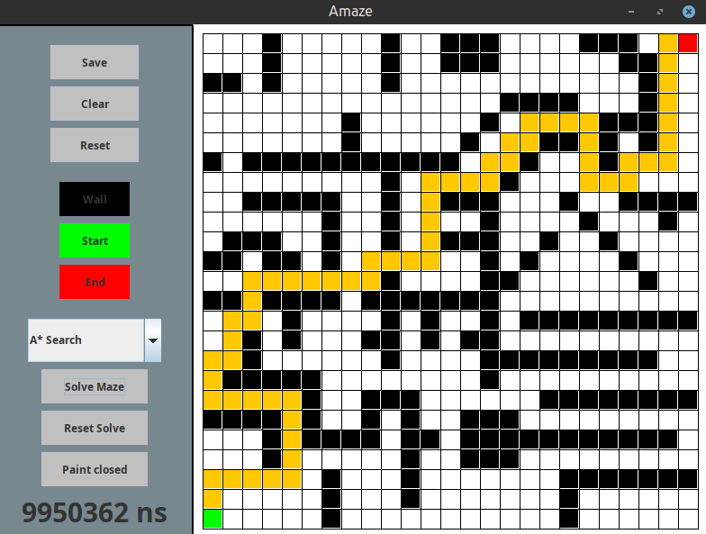
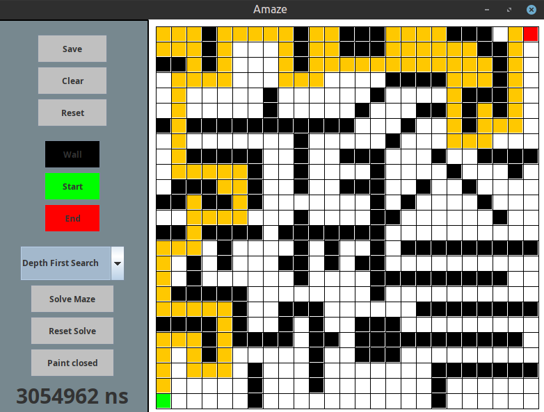
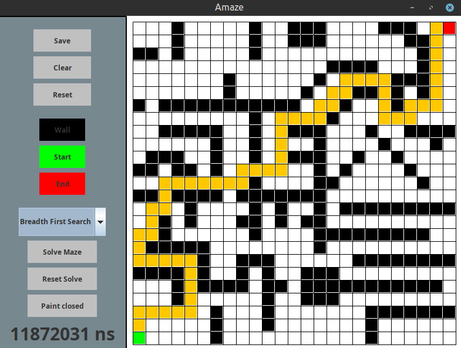
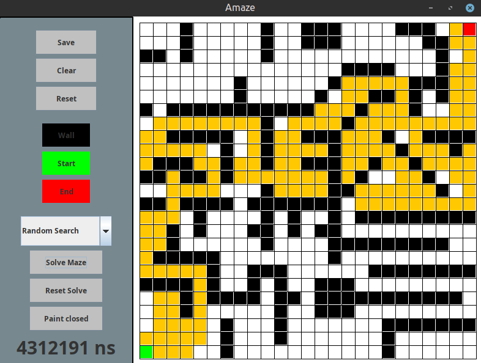
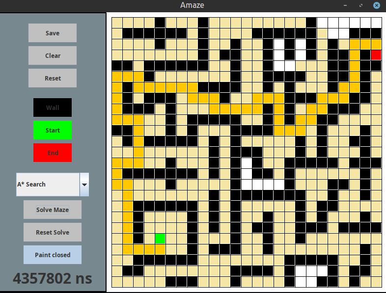
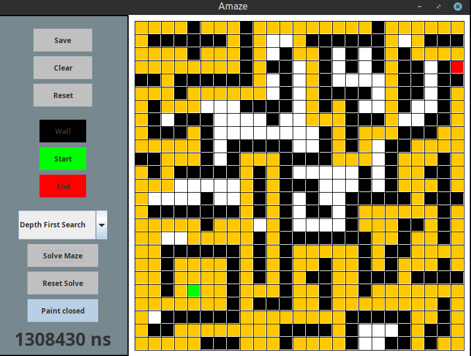

# Amaze
## Graph search visualisation tool built in Java
This is a visualisation tool for graph search algorithms. 
You are given a 25 by 25 grid and can create a maze of wall pieces with a start and end tile. 
You are then able to select a pathfinding algorithm (A*, depth first search, breadth first search, or random search) and display the path it finds.
You can also choose to display all the nodes that the algorithm visits in the process of finding the path.
This allows you to compare the path found by different algorithms, as well as see a rough time comparison for the time it takes to run.
You can also save your created maze so it will be there next time the programme runs.

## Screenshots
 
 
 
